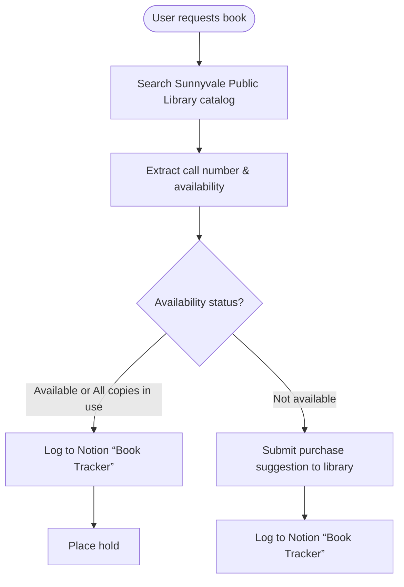

# AI Library Assistant: Automated Book Tracking System
  
https://www.loom.com/share/fb11f3ca567b4ffe9f29b81c4a6a6b72?sid=3ee90985-1da4-4c31-99c9-d4e7752cc6ea

## Problem
Finding and tracking books in libraries requires multiple manual steps:
- Searching library catalogs
- Recording call numbers and availability
- Maintaining organized search records
- Checking book status over time

This process is time-consuming and often leads to lost information.

## Solution
An AI assistant that automatically:
- **Searches** the Sunnyvale Public Library catalog (a home library) when you ask for a book
- **Finds** the book's call number and availability status
- **Saves** all the information to a Notion database called "Book Tracker"
  
Simply ask the assistant for any book, and it handles everything from search to storage automatically.

## Tech Stack
- **LangChain, LangGraph and LangGraph Studio**: Orchestrates the AI workflow, API toolings/routing and manages conversation flow with easy debugging.
- **Notion API**: Stores book information in a structured database
- **Webpage Parsing Library**: Extracts book details from library catalog pages
- **GPT-4o**: Powers natural language understanding and intelligent responses

## Results
- **Faster Book Discovery**: Get book information in seconds instead of minutes
- **Organized Records**: All searches automatically saved and categorized
- **Easy Tracking**: Monitor book availability changes over time
- **No More Lost Notes**: Centralized database prevents information loss
- **Simple Interface**: Just ask for a book in plain English

The system transforms library research from a manual, multi-step process into a smooth, automated experience.
